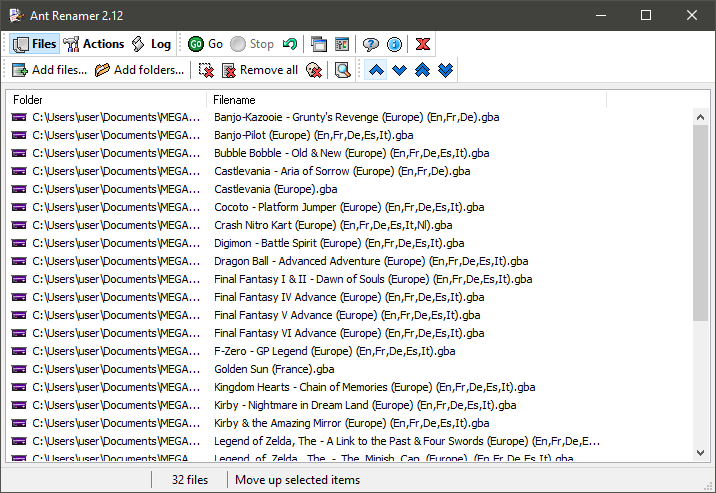
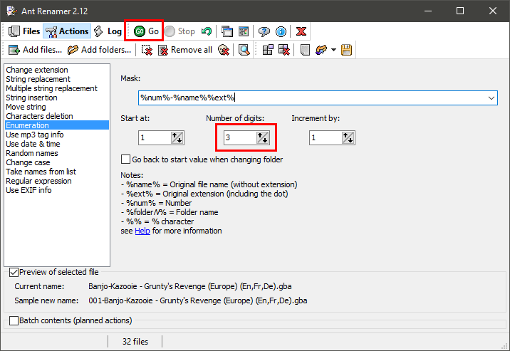
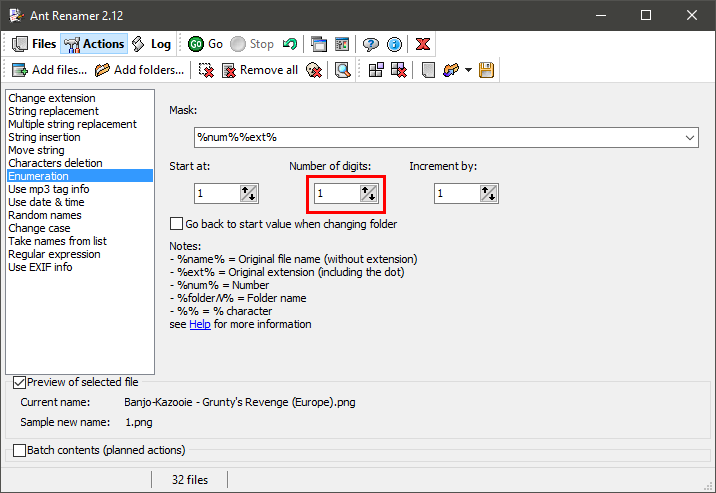

# Retroarch Entries Maker for ulaunch

[English version](../README.md)
# Prérequis :
Avant de commencer, vous devez installer la [dernière version de Python](https://www.python.org/downloads/) et je vous recommande d'installer la dernière version d'Ant Renamer.
# Comment l'utiliser :
Tout d'abord, créez un dossier n'importe où sur votre ordinateur et placez toutes vos roms dans ce dossier. Ensuite, créez un dossier que vous renommerez "Icons" à l'intérieur du dossier des roms et placez toutes vos icônes à l'intérieur. Vérifiez que vos images ont une taille raisonnable (je recommande de les mettre en 256x256), si ce n'est pas le cas, vous pouvez redimensionner plusieurs images en utilisant la fonction Automatisation de Photoshop. Ensuite, démarrez Ant Renamer et déplacez toutes vos roms dans la fenêtre principale :

Ensuite, allez dans la catégorie Actions et sélectionnez Enumeration. Dans Mask, entrez :

> %num%-%name%%ext%

Et mettez "number of digits" à 3 (si vous avez plus de 1000 fichiers, mettez-le à 4), ça permettra d'éviter un bug dû à la différence dans la classification par ordre alphabétique entre votre système d'exploitation et Python (surtout entre Windows et Python, je ne sais pas s'il y a cette différence avec Linux ou Mac), et appuyez sur GO :

Maintenant, retournez dans la catégorie Files, retirez tous les fichiers présents dedans et déplacez vos icônes dans la fenêtre. Vous pouvez utiliser les flèches bleues en haut pour faire correspondre l'ordre des icônes avec l'ordre des roms. Retournez ensuite dans la fenêtre Actions et sélectionnez Enumeration. Maintenant, entrez dans Mask :

> %num%%ext%

Et mettez "number of digits" à 1 et appuyez sur GO:

Maintenant tous vos fichiers sur prêts ! Lancez Retroarch_Entry_Maker.py. Si vous avez déjà généré des entrées, il vous demandera si vous voulez supprimer les précédents fichiers, je vous recommande d'accepter si vous ne voulez pas avoir de doublons. Quand vous verrez :

> Enter your roms directory:

Copiez-collez simplement le chemin vers le dossier des roms, par exemple :

> C:\Users\user\Desktop\roms

Note : Vous pouvez remplacer "\\" par "/" si vous voulez

Ensuite, appuyez sur Entrée et attendez jusqu'à ce qu'il dise "Done!" et appuyez une nouvelle fois sur Entrée.

Maintenant, rendez-vous dans le dossier "output" et copiez-collez les dossiers "Roms" et "ulaunch" à la racine de votre carte SD. Vous pouvez maintenant jouer à vos jeux en lançant AMS !

# Extensions supportées :
-----Amstrad CPC-----

.dsk

.sna

.kcr

---------DOS---------

.exe

.com

.bat

.conf

---------MSX---------

.rom

.mx1

.mx2

.cas

----Intellivision----

.int

---------NES---------

.nes

.fds

---------SNES--------

.smc

.sfc

.swc

---------GBA---------

.gba

---------GBC---------

.gbc

.cgb

.sgb

----------GB---------

.gb

.dmg

----Master System----

.sms

-------GameGear------

.gg

-------Genesis-------

.sg

.smd

.gen

------Megadrive------

.md

---------MAME--------

.chd

---------N64---------

.n64

.v64

.z64

.u1

.ndd

---------PS1---------

.bin

.img

-----Pokemon Mini----

.min

------Atari 7800-----

.a78

------Atari 2600-----

.a26

-------Vectrex-------

.vec

--------Saturn-------

.ccd

.mds

---------PSP---------

.iso

.cso
